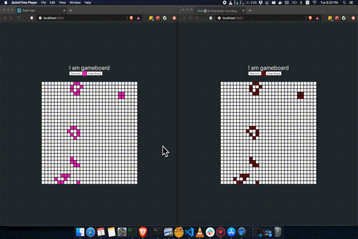

# Conway's game of life

### Description

Conway's game of life

### Screencast



### Context

The `server/Game.js` is based from `https://github.com/denistsoi/game-of-life` which has been ported over to this repository. The code itself is based from codingtrain's 


### instructions

> Create a multiplayer Web app version of Game of Life, with the following functions. 

1. Implement the Game of Life in browser. You can use any representation such as `<canvas>`, simple DOM manipulation or even `<table>` cells. 

2. The game should tick automatically at a predefined interval, at say, 1 step per second.

3. The browser connects to an HTTP server, written in Ruby or Node.js (can be any frameworks, e.g. Ruby on Rails, Sinatra, EventMachine, Hapi or just plain listening on a socket). This server allows multiple browser to share the same, synchronized world view.

4. Each client is assigned a random color on initialization. From the browser, clicking on any grid will create a live cell on that grid with the client's color. This change should be synchronized across all connected clients. (You can use any mechanism to achieve this, such as polling, comet or WebSocket)

5. When a dead cell revives by rule #4 "Any dead cell with exactly three live neighbours becomes a live cell, as if by reproduction.", it will be given a color that is the average of its neighbours (that revive it).

6. To make the evolution more interesting, include a toolbar that places some predefined patterns at random places with the player's color, such as those found at [here](https://en.wikipedia.org/wiki/Conway's_Game_of_Life#Examples_of_patterns) (not necessary to implement all, just 3 - 4 is fine).


### todos

- [x] fix syncing issue with server/client
- [x] move configuration to server side

#### outstanding todos
- [ ] add patterns  
- [ ] add color/ random color to server game state (to generate average color)  

#### outstanding todos
- [ ] add timer to next cycle
- [ ] add current life cycle (max-cycles)
- [ ] disable selection of cell if not current player


### How to use

```
npm i
npm run dev:server
npm run start
```

### Author
Denis Tsoi <denistsoi@gmail.com>

### Licence
MIT